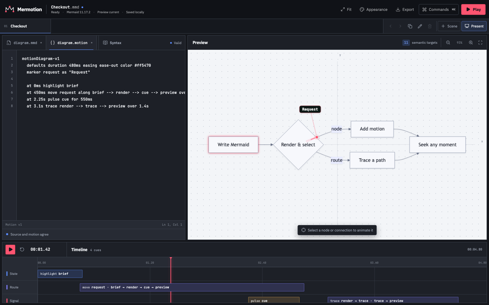

# Mermotion

Mermotion pairs an ordinary Mermaid diagram with an optional `.motion` sidecar. Mermaid owns the
diagram; the sidecar says what moves and when. The web editor opens both as one document, previews
the result, and stores drafts locally.



## Canonical M1 profile

```text
checkout.mmd       standard Mermaid: structure, layout, frontmatter, theme
checkout.motion    optional Mermotion: timing and effects
```

```motion
motionDiagram-v1
  defaults duration 480ms easing ease-out color #ff5470
  marker request as "Request"

  highlight client
  with pulse api for 600ms
  move request along client --> api --> worker over 1.8s
  trace api --> worker over 800ms
```

Keep one `defaults` line and use bare Mermaid IDs. Unprefixed cues run in sequence; `with` overlaps
the preceding cue, while `at 2.4s` pins a cue to an exact time. Effects take `for`, paths take `over`,
and colors use six hexadecimal digits. A marker is a dot in M1, so its declaration does not need a
shape clause.

Website authoring controls and agents write this profile. They never emit Mermaid-generated SVG IDs,
YAML, JSON, CSS selectors, keyframes, or keywords that are not part of the motion language. The
editor can write a cue from a selected rendered node or connection without touching the Mermaid
file.

Named markers follow Mermaid's measured edge geometry, pass continuously through intermediate
nodes, and keep their identity after arrival. See
[`docs/design/motion-behavior.md`](docs/design/motion-behavior.md) for the motion rules and proof
thresholds. [`docs/motion-language.md`](docs/motion-language.md) separates canonical M1 source from
the wider parser compatibility surface.

## Current status

The local v1 is implemented. A checked-in browser matrix renders all 30 user-facing diagram
families and 33 syntaxes exposed by Mermaid 11.17.2. Flowcharts and sequence diagrams also have
stable subtarget bindings, so their motion survives label, source-order, layout, and theme edits.
Other diagram families can use whole-diagram motion; they need family-specific identity rules before
Mermotion will claim stable node or connection targeting for them.

The editor samples `motionDiagram-v1` deterministically, stores its workspace in browser IndexedDB,
and keeps Mermaid theme data inside `.mmd`. Its Source pane includes a searchable syntax reference
whose insertions use semantic Mermaid IDs without changing the diagram file. A numbered scene rail
adds multi-step editing and a presentation view without adding scene keywords to the motion
language.

Both the website and CLI export animated GIFs. `mermotion render` also performs the authoritative
rendered-target check and writes exact SVG or PNG frames. The browser driver stays behind the CLI;
parse, format, compile, and sample remain ordinary Node commands.

Mermotion runs locally. It has no account system, application server, server database, hosted share
links, or MCP server. The preview uses an opaque, network-disabled frame and strips external
resources before SVG enters the workbench. Agents use the same CLI through a portable Mermotion
skill.

## CLI installation

Mermotion requires Node.js 24.20.0 or newer. Run a command without changing the current project:

```sh
pnpm dlx mermotion@0.1.0 validate checkout.mmd
```

For repeated use in a project, install the CLI and prepare its managed Chromium renderer once:

```sh
pnpm add --save-dev mermotion
pnpm exec mermotion setup
pnpm exec mermotion render checkout.mmd -o checkout.gif
```

Validation, formatting, compilation, and sampling run in Node. SVG, PNG, and GIF rendering runs in
a local, network-disabled Chromium realm and never uploads diagram data.

### Agent skill

The portable skill in [`.agents/skills/mermotion`](.agents/skills/mermotion/SKILL.md) teaches agents
the canonical language and CLI verification workflow. Install that directory with an agent's skill
installer or copy it into the agent's skills directory. The skill carries its own syntax reference
and does not require a Mermotion source checkout.

## Export an animated GIF

1. Finish a valid preview, then open **Export**.
2. Choose a 640, 960, or 1280 pixel width preset and a cadence of 10, 20, or 25 fps.
3. Pick **Loop forever**, **Play once**, or **Set count**. Counted loops accept 2–65,536 total plays.
4. For a looping GIF, optionally hold the final frame for 0.25, 0.5, 1, or 2 seconds, then choose
   **Export GIF**.

**Use 640px · 10fps** applies a conservative Notion preset. After encoding, the panel reports
whether the GIF stays under the 5 MB upload target. Upload the downloaded file to Notion normally;
Mermotion doesn't connect to a Notion account.

The browser downloads `checkout.gif`. Animated bounds are measured at the requested output size, so
a moving marker, tail, label, callout, or shadow isn't clipped by Mermaid's original view box. An
export can contain up to 600 sampled frames, and tall diagrams scale down to stay within the
encoder's 2,400 pixel height limit. The panel asks for a lower width, frame rate, or duration before
the work can overwhelm the tab.

Use **Bundle** under **Project source** to download `workspace.mermotion.json`. It contains every
scene and keeps the active `diagram.mmd` plus `diagram.motion` pair at the top level for older tools.

## Scenes

**Scene** adds a new Mermaid and motion pair. The rail can rename, duplicate, reorder, or delete the
active scene; switching scenes preserves each source pair independently. **Present** opens the
diagram at full workbench size with previous, next, play, and direct scene controls. Escape returns
to the editor without losing source.

Scenes belong to the local workspace container, not `diagram.motion`. A copied `.mmd` and `.motion`
pair therefore stays readable by Mermaid and the CLI without story metadata.

Browser draft recovery uses revisioned IndexedDB writes. If two tabs edit the same workspace, the
older one stops autosaving and asks for a reload instead of replacing the newer tab's work. A local
storage failure still leaves the current sources editable and available through **Bundle**.

## Appearance and color ownership

Open **Appearance** to choose Graphite, Blueprint, Paper, or Midnight, then override individual interface roles. Those desk settings belong to the local workspace and stay in IndexedDB; they never alter exported source.

Diagram colors belong to `diagram.mmd`. Editing them writes Mermaid's standard
`config.themeVariables` frontmatter and sets `config.theme` to `base`, so Mermaid remains the
renderer of record. Its `background` value also colors the preview underlay. The motion signal lives
on the single `defaults` line in `diagram.motion` as a six-digit hexadecimal color.

**Reset all colors** restores the Graphite desk, the starter Mermaid palette, and the default
raspberry motion signal. It preserves diagram structure and motion cues; compatibility-only cue
colors remain untouched.

## Development

Requirements:

- Node.js 24.20.0 or a compatible newer release
- pnpm 11.25.0
- One-time local renderer setup for CLI SVG, PNG, and GIF output

After dependencies are installed:

```sh
pnpm mermotion setup
pnpm dev
pnpm verify
pnpm --filter @mermotion/cli test:render
pnpm test:e2e
```

`mermotion setup` installs the managed Chromium binary. A Linux source checkout also needs Chromium's
system packages; [`CONTRIBUTING.md`](CONTRIBUTING.md) gives the full setup command. There is no browser
selector or separate target-discovery command in the Mermotion interface. Parsing, checking, and
formatting remain plain Node operations.

The CLI pairs a Mermaid file with a same-name motion sidecar. The `pnpm mermotion` source-checkout
shortcut rebuilds before it runs, so use it for human-readable output:

```sh
pnpm mermotion validate checkout.mmd
pnpm mermotion motion fmt checkout.motion --check
pnpm mermotion render checkout.mmd --at 1.25s -o checkout-frame.svg
pnpm mermotion render checkout.mmd --at 1.25s -o checkout-frame.png
pnpm mermotion render checkout.mmd -o checkout.gif
pnpm mermotion render checkout.mmd -o checkout-once.gif --loop once
pnpm mermotion render checkout.mmd -o checkout-loop.gif --loop 3 --hold 250ms
```

After `pnpm build`, invoke the built entry point directly when stdout must contain one JSON envelope:

```sh
node packages/cli/dist/index.js motion check checkout.mmd --json
node packages/cli/dist/index.js motion compile checkout.mmd --json
node packages/cli/dist/index.js sample checkout.mmd --time 1.25s --json
node packages/cli/dist/index.js render checkout.mmd --check --json
```

Read [`docs/motion-language.md`](docs/motion-language.md) for the authoring syntax and
[`docs/architecture/mermaid-upgrades.md`](docs/architecture/mermaid-upgrades.md) for the pinned
upgrade path. See [`docs/project.md`](docs/project.md),
[`docs/architecture/system.md`](docs/architecture/system.md), and
[`.ai/project/state.md`](.ai/project/state.md) for scope and current proof. This repository also ships
[the portable Mermotion skill](.agents/skills/mermotion/SKILL.md).

## License

[MIT](LICENSE)
