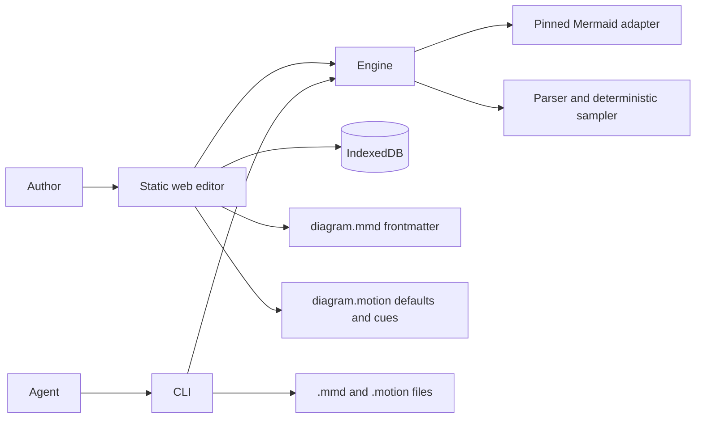

# Mermotion system

**State described:** implemented M1-U1 architecture. Planned M1-U2 boundaries are labeled below.

Mermotion has three workspaces. `apps/web` owns the editor and browser persistence. `packages/engine` owns the document model, motion language, Mermaid adapter, compiler, deterministic sampler, and browser player. `packages/cli` exposes non-interactive file operations and structured output. There is no internal HTTP API.

## Boundaries

- Mermaid parses and renders `.mmd`; Mermotion does not reimplement its grammar.
- The adapter converts pinned Mermaid SVG details into a neutral inventory for the diagram root, flowchart nodes and edges, and sequence participants and messages.
- The engine is persistence-independent and cannot access IndexedDB directly.
- IndexedDB stores the current source pair and local appearance preference. Appearance contains one of four shell presets plus optional per-role overrides; resizable pane positions use `localStorage`. The appearance object does not contain diagram or motion color.
- Diagram color lives in standard Mermaid frontmatter. The editor writes `config.theme: base` with `config.themeVariables`; Mermaid still parses and renders the file. The frontmatter `background` value also supplies the preview underlay.
- The local Canvas frame remains visible as an inset surround around that source-owned underlay; it does not replace the Mermaid background.
- Motion color lives in `.motion`. `defaults color` provides the document default, and a statement-level `color` overrides it for that effect or marker move. The renderer applies no replacement color when neither appears.
- The current preview renders Mermaid with `securityLevel: strict` in the application document, then adds accessibility attributes, semantic bindings, and transparent connection hit areas.
- The CLI uses Mermaid's Node parse path plus pure motion formatting, compilation, and sampling. It does not render SVG or inventory real targets yet; target-bearing commands return `targetResolution: "inferred"` and `CLI_TARGETS_NOT_VERIFIED`.
- With no motion, the engine applies no motion styles or animation state. The editor preserves Mermaid's rendered appearance while adding the target-selection annotations above.

## Appearance writes

The Appearance sheet presents three write paths rather than merging them into a hidden theme object:

- **Desk** and **Interface/Signals** update the IndexedDB appearance preference.
- **Diagram** rewrites only Mermaid theme fields in `.mmd` and leaves diagram statements plus unrelated frontmatter intact.
- **Motion Signal** updates the `defaults color` modifier in `.motion`; cue-level color modifiers remain intact.

Reset restores the Graphite preference, the starter Mermaid palette, and `defaults color #ff5470`. It does not clear either source file or remove cue-level overrides. The shell's Transport role remains local and independent of Motion Signal.

## Planned M1-U2 boundaries

- Render project content in a sandboxed browser realm and communicate through typed messages.
- Package a browser bridge for an opt-in CLI `targets` or `--resolve-targets` path. Syntax and formatting commands must remain browser-free.
- Resolve target existence and ambiguity against the rendered SVG before the CLI calls target-aware compilation or sampling.

## Failure behavior

Invalid Mermaid retains the last valid preview and shows source diagnostics. Invalid motion disables only affected cues. In the web editor, a missing, ambiguous, or drifted semantic target never binds to the first nearby SVG element. The Node-only CLI marks target resolution as inferred until M1-U2. Storage failure leaves the current in-memory document usable and keeps explicit download available.
