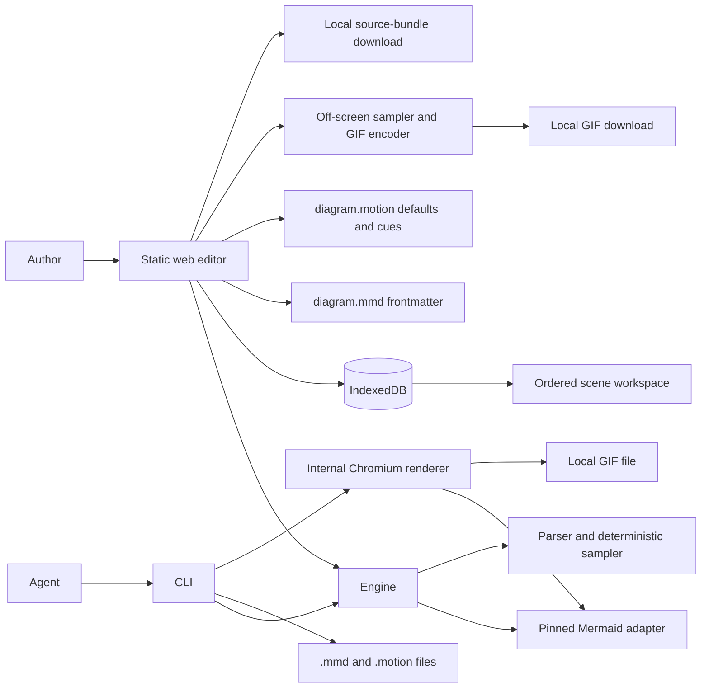

# Mermotion system

**State described:** public version 0.1.0.

Mermotion has three workspaces. `apps/web` owns the editor and browser persistence. `packages/engine` owns the document model, motion language, Mermaid adapter, compiler, deterministic sampler, and browser player. `packages/cli` exposes non-interactive file operations and structured output. There is no internal HTTP API.

## Boundaries

- Mermaid parses and renders `.mmd`; Mermotion does not reimplement its grammar.
- The adapter converts pinned Mermaid SVG details into a neutral inventory for the diagram root,
  flowchart nodes and edges, and sequence participants and messages. A real-browser matrix verifies
  whole-diagram rendering for all 30 user-facing Mermaid 11.17.2 families and 33 syntaxes.
- The engine is persistence-independent and cannot access IndexedDB directly.
- IndexedDB stores the ordered scene workspace and local appearance preference. Each scene owns one
  Mermaid and motion source pair. Version-two storage migrates the original single-pair record;
  each write compares an integer workspace revision inside the same read-write transaction, so a
  stale tab cannot replace newer work. Connections close after each operation, and blocked opens
  fail on a bounded timeout. Resizable pane positions use `localStorage`. Appearance contains one of
  four shell presets plus optional per-role overrides and never contains diagram or motion color.
- Diagram color lives in standard Mermaid frontmatter. The editor writes `config.theme: base` with `config.themeVariables`; Mermaid still parses and renders the file. The frontmatter `background` value also supplies the preview underlay.
- The local Canvas frame remains visible as an inset surround around that source-owned underlay; it does not replace the Mermaid background.
- Motion color lives in `.motion`. Canonical source puts it on the `defaults` line. The parser
  preserves statement-level overrides in compatibility and advanced source, and the renderer applies
  no replacement color when neither form appears.
- The preview renders Mermaid with `securityLevel: strict` inside a hidden, CSP-restricted frame
  with an opaque origin. A validated `postMessage` protocol returns render results without granting
  the frame parent-DOM access. Before the SVG enters the workbench, external resources, links, event
  handlers, and SVG animation elements are removed; the application then adds accessibility
  attributes, semantic bindings, and transparent connection hit areas. A timed-out render replaces
  the whole frame document with a fresh CSP nonce, so a stuck Mermaid runtime cannot poison later
  renders.
- The CLI uses Mermaid's Node parse path plus pure motion formatting, compilation, and sampling.
  Those browser-free commands do not inspect rendered SVG. `mermotion render` is the authoritative
  path: it uses an internal Chromium adapter to render Mermaid, inventory real targets, compile,
  sample, and write SVG, PNG, or GIF.
- With no motion, the engine applies no motion styles or animation state. The editor preserves Mermaid's rendered appearance while adding the target-selection annotations above.
- There is no hosted application tier. Local files and IndexedDB are the only project stores, and
  explicit local export is the only path out of the workspace.

## Appearance writes

The Appearance sheet presents three write paths rather than merging them into a hidden theme object:

- **Desk** and **Interface/Signals** update the IndexedDB appearance preference.
- **Diagram** rewrites only Mermaid theme fields in `.mmd` and leaves diagram statements plus unrelated frontmatter intact.
- **Motion Signal** updates the `defaults color` modifier in `.motion`; compatibility-only cue color
  modifiers remain intact.

Reset restores the Graphite preference, the starter Mermaid palette, and `defaults color #ff5470`. It
does not clear either source file or remove compatibility-only cue overrides. The shell's Transport
role remains local and independent of Motion Signal.

## Motion rendering

Route movement, tails, arrival, traces, pulses, and callouts share the deterministic sampled clock.
Each marker owns one retained bead and two retained full-route paths whose painted intervals end at
the marker. A zero-to-peak-to-zero ring marks arrival, then the bead remains at the destination.
There are no generated particles, edge wakes, or cloned node outlines.

Geometry measurement happens during render or cache refresh. The warmed playback path reuses route
plans, sampled geometry, target centers, overlay elements, and source colors; it updates transforms,
widths, opacity, and dash attributes without rescanning bounds or rebuilding children. Tail and
trace widths are converted to root user units at the current preview scale. Their paths deliberately
avoid `non-scaling-stroke`, because combining it with normalized dash geometry shifts paint away
from the sampled route position in scaled SVGs. Reduced-motion mode keeps the marker position while
removing its decorative halo, tails, and arrival ring.

## Website export

Animated GIF export starts only from a valid current render and compiled timeline. The website
copies the sanitized Mermaid SVG into an off-screen host, discovers its semantic targets, and
applies the shared deterministic sampler at each frame timestamp. Each frame is rasterized into a
canvas; `gifenc` encodes the resulting pixels, and the browser downloads the bytes as
`checkout.gif`. Export does not capture the visible workbench or depend on its zoom level. Before
encoding, it first sizes the SVG to the requested output, seeks every planned timestamp, and unions
transformed motion geometry with Mermaid's original view box. It also pads Mermotion's screen-sized
strokes and shadow kernels, then repeats until both the painted edges and integer output dimensions
stabilize. The fixed result keeps markers, labels, tails, callouts, pulses, and highlights inside
every frame, including downscaled and height-capped exports.

Width presets are 640, 960, and 1280 pixels, with 10, 20, or 25 frames per second. Tall diagrams
keep their aspect ratio and scale down if the requested width would exceed the 2,400 pixel encoder
height limit. A GIF can contain up to 600 sampled frames. Loop metadata supports forever, once, or
an explicit total play count. Looping exports can add an optional 0.25, 0.5, 1, or 2 second
final-frame hold; one-shot exports do not add that hold. Frame capture runs serially so progress and
cancellation remain available between samples. A 120 million pixel-frame preflight rejects
dimension, cadence, and duration combinations that would put unreasonable work on the browser's
main thread.

The Notion control applies 640 pixels at 10 fps, then reports whether the encoded file stays under
the 5 MB target. This is a local compatibility preset, not a Notion API integration.

The Export panel downloads `workspace.mermotion.json` with every ordered scene. Top-level
`diagram.mmd` and `diagram.motion` mirrors keep the active pair readable by older consumers. Neither
export path uploads data, invokes the CLI, or needs an application server or database.

## CLI rendering

`mermotion render` reads a `.mmd` file and optional same-name `.motion` sidecar, invokes Mermaid in a
real browser layout environment, discovers semantic SVG bindings, and compiles motion. SVG and PNG
sample an explicit `--at` time. A GIF output seeks the entire timeline in the same page, uses the
same output-scale viewport settlement as the website, and encodes at 960 pixels and 20 fps; `--loop`
and `--hold` control its playback metadata.

A sandboxed process plus a fresh context and page are created for each invocation; unexpected
network requests are blocked, active external resources are removed from exported SVG, and bounded
deadlines cover setup, rendering, and cleanup. Missing or ambiguous targets fail before output is
written. Playwright supplies the driver, so contributors install its Chromium binary during setup.
Callers choose source, time, and output; Mermotion exposes no browser selector or test harness.
Parse, check, format, compile, and sample continue to run in plain Node.

## Scene workspace

Scenes are a website container, not motion grammar. Add, rename, duplicate, delete, reorder, and
select operate on immutable source-pair records. Presentation mode replaces the editor chrome with
the same preview component and adds manual scene navigation; it does not introduce a second player.
Switching scenes clears transient selection, diagnostics, and playback time, then renders the chosen
pair. The active source remains available after leaving presentation.

## Failure behavior

Invalid Mermaid retains the last valid preview and shows source diagnostics. A renderer timeout
destroys the stuck iframe realm; the exact source is not retried automatically in a loop, while an
explicit render or source edit can use the replacement realm. Invalid motion disables only affected
cues. In the web editor, a missing, ambiguous, or drifted semantic target never binds to the first
nearby SVG element. Browser-free CLI commands are not binding checks; `mermotion render` fails
missing or ambiguous references after Mermaid has produced SVG. Storage failure disables autosave
for that page but leaves the current in-memory document usable and keeps explicit download available.
A revision conflict also stops autosave and asks for a reload without overwriting either tab's copy.

## Permanent exclusions

The system will not gain accounts, hosted projects, public share URLs, collaboration services, an
HTTP application API, or a server database. Agent automation wraps the CLI in an instructional skill;
it does not add MCP or a second engine interface.
